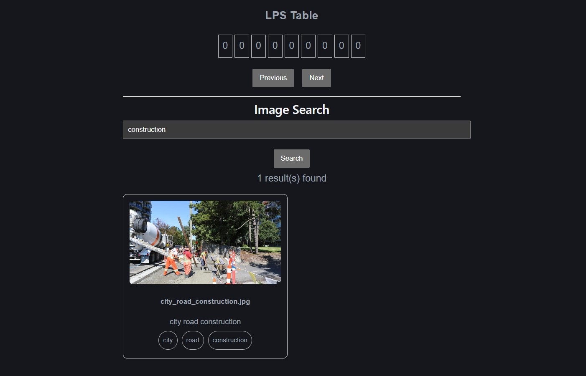
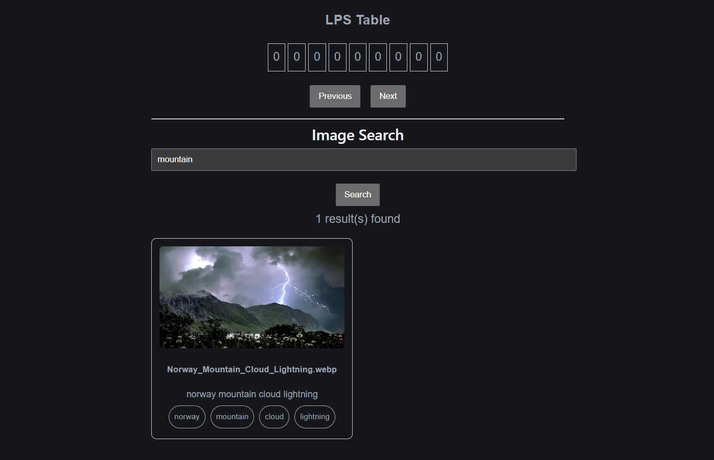
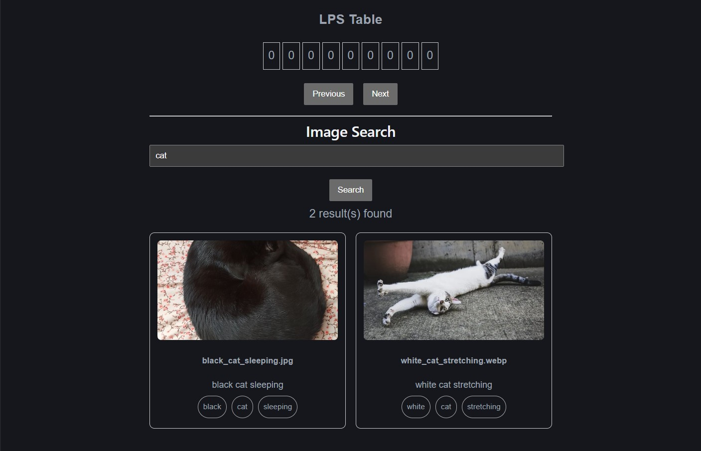

# Interactive-Algorithm-Visualizer-Platform
## Overview
An interactive full-stack web application that visualizes algorithm execution step-by-step to help users understand complex computational processes. The long-term goal of the platform is to support additional algorithms including DFA simulation, graph traversal algorithms (BFS/DFS), shortest path algorithms, dynamic programming visualizations, and local file/image search tools.

## Completed features
### KMP visualizer

a Knuth-Morris-Pratt (KMP) string matching visualizer that demonstrates pattern searching, prefix table construction, and character-by-character comparisons through an intuitive graphical interface.

Built with a React frontend and FastAPI backend, the application generates detailed execution traces that allow users to navigate algorithm states, inspect internal variables, and observe how algorithm decisions evolve over time. The project aims to make fundamental computer science concepts more accessible through interactive visualization and real-time feedback.

#### Features
- Step-by-step visualization of the KMP string matching algorithm
- Interactive text and pattern comparison highlighting
- Dynamic LPS (Longest Prefix Suffix) table construction display
- Forward and backward navigation through algorithm execution states
- FastAPI backend that generates structured execution traces
- React-based frontend with real-time visualization updates
- Automated testing and continuous integration using GitHub Actions

#### Screenshots


### Image/File Search Framework

An interactive full-stack search application that enables users to locate images and files using keyword-based pattern matching across filenames, tags, and descriptive metadata. The framework leverages the Knuth-Morris-Pratt (KMP) string matching algorithm to efficiently identify relevant records and return searchable results through a responsive graphical interface.

Built with a React frontend and FastAPI backend, the application automatically indexes image assets, extracts searchable metadata from filenames, and generates a structured search database for efficient retrieval. User queries are processed through a custom search engine that performs pattern matching against indexed file records and displays matching images with associated metadata. The project aims to bridge algorithmic pattern matching with practical search engine functionality while providing a foundation for future enhancements such as local file indexing, metadata extraction, AI-generated image captions, and desktop search capabilities.

#### Features

- Keyword-based image and file search using the KMP string matching algorithm
- Automated image indexing pipeline that scans directories and generates searchable metadata records
- Search across filenames, tags, descriptions, and indexed file metadata
- Interactive image gallery with real-time search results and metadata display
- Clickable image previews linking directly to original image assets
- FastAPI backend for search processing, indexing, and metadata retrieval
- React-based frontend with dynamic query submission and result rendering
- Static asset serving for image storage and retrieval
- Automated testing and continuous integration using GitHub Actions

#### Current Architecture

```text
Image Directory
       │
       ▼
Automated Indexing Script
       │
       ▼
Searchable Metadata Database (JSON)
       │
       ▼
FastAPI Search API
       │
       ▼
React Search Interface
```

#### Planned Enhancements

- Recursive indexing of local folders and subdirectories
- SQLite-backed metadata storage and indexing
- File type, size, and date filtering
- Relevance ranking and fuzzy search capabilities
- AI-generated image captions and automatic tagging
- Desktop-scale file and image search across user-selected directories


#### Screenshots




## Tech Stack

Frontend
- React
- Vite
- JavaScript
- Node.js

Backend
- Python
- FastAPI
- Uvicorn

Development Tools
- GitHub/Git
- VS Code
- GitHub Actions
- Pytest

## Ongoing development
- local file/image search
- DFA simulation